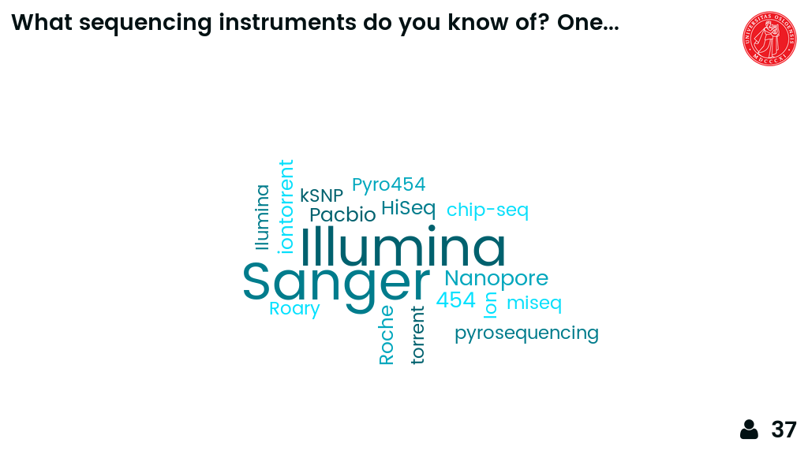
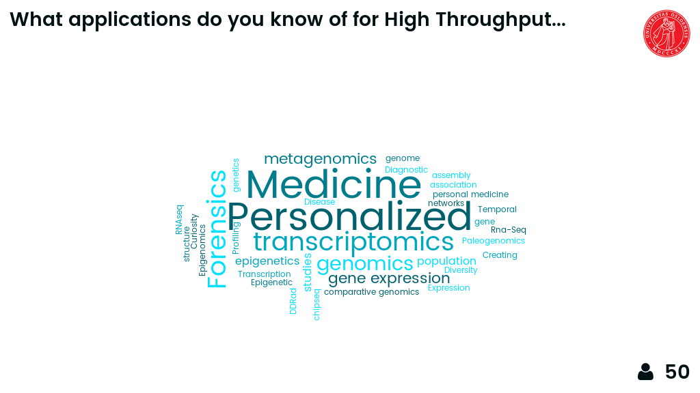
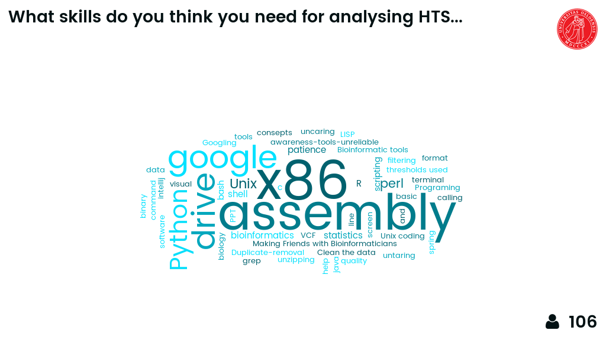

#Intro to High Throughput Sequencing and applications

Day 1 of the INF-BIO5151/9121 course "High Throughput Sequencing technologies and bioinformatics analysis"

## Sequencing technologies

####What sequencing platforms do you know
Exercise using Mentimeter wordcloud

* Illumina HiSeq 1000 1500 2000 2500 3000 4000
* Illumina HiSeq X (Five and Ten)
* Illumina NextSeq 500
* Illumina MiSeq
* Pacific Biosciences RSII
* Ion Torrent PGM
* Ion Torrent Proton
* Ion Torrent S5 and S5XL
* Oxford Nanopore MinION (MkI), PromethION, GridION
* Roche 454 GS FLX, Junior
* SOLiD 1 2 3 4 5500 5500XL
* BGI revolocity
* HeliScope
* ABI Sanger 3730xl

Special types

* 10X genomics
* Moleculo/TruSeq synthetic reads
* BioNano Genomics

####Read lengths versus throughput for sequencing instruments
Exercise using Google sheets:

* for each sequencing instrument still being sold, find the specifications on the company website
* make a plot in a google spreadsheet with the read length on the x-axis and the per-run throughput in Gigabp on the Y axis
* make both axis log scale
* my example is [here](https://docs.google.com/spreadsheets/d/1ZJov9oT5Zoe4nfxKBewayvJrHscMljWSAnT5mU-X5Fs/edit?usp=sharing)

Discuss my version on figshare: <http://figshare.com/articles/developments_in_NGS/100940>. See also [my blog post]( https://flxlexblog.wordpress.com/2015/06/17/developments-in-high-throughput-sequencing-june-2015-edition/) on the most recent edition.

Slide with figure 1 from [Reuter *et al* 2015](http://dx.doi.org/10.1016/j.molcel.2015.05.004).

####Similarities between all sequencing platforms
Exercise using mentimeter wordcloud - skipped

####Details on the technology behind the different sequencing platforms

*In detail:* Illumina library preparation and sequencing  
<https://www.youtube.com/watch?v=womKfikWlxM>

*In detail:* PacBio library preparation and sequencing  
<https://www.youtube.com/watch?v=v8p4ph2MAvI>
*Slide:* SMRTBell

*In detail:* Oxford Nanopore MinION library preparation and sequencing  
<https://nanoporetech.com/science-technology/movies#movie-24-nanopore-dna-sequencing>

*In detail:* 10X genomics
<https://vimeo.com/120429438>

*In detail:* BioNano Genomics
<https://vimeo.com/116090215>

####What read types do you know?

Slides/whiteboard: Paired end versus single end versus mate pair, subreads, 2D reads

####What applications do you know of for HTS?
Exercise using mentimeter wordcloud

Illumina [has a poster](http://www.illumina.com/applications/sequencing/ngs-library-prep/library-prep-methods.html) with all library preparation methods. 

Lior Pachter has "an up-to-date annotated bibliography of *Seq assays (functional genomics assays based on high-througphput sequencing)" on [this page](https://liorpachter.wordpress.com/seq/).

Slide with figure 4 from [Reuter *et al* 2015](http://dx.doi.org/10.1016/j.molcel.2015.05.004).

####Selected applications

* RNA-seq
* Assembly and metagenomics
* ChIP-seq
* Amplicon sequencing
* SNP typing and discovery
* Single-cell sequencing

##Principles and problems of HTS data analysis

####What skills do you think you need for analysing HTS data?
Exercise using mentimeter wordcloud.  
'Tube map' from <http://nirvacana.com/thoughts/becoming-a-data-scientist/>.

Slides:

| Subject  | Items  | HTS data analysis example|
|:-------|:--------------|:--------------------|
|**Data**| Amount of data|multi-GB fastq files 
||Finding data|ENA, SRA, ensembl, UCSC|
||Getting data in the right shape|fastq versions|
||Scrubbing|read errors, denoising of amplicons|
||Understanding the data (file formats)|vcf file format|
||Data management (storing, copying, moving data)|store `bam` files?|
||Sharing data|ENA, SRA|
|**Software**|Understanding the algorithms|mapping reads|
||Installing software|don't get me started|
||Choosing program from all possible|mapping programs|
||Can not always use the same tool|availability of a reference genome|
||Not always the same tool that is best|iMetAmos|
||Software parameter space|kmer size for assembly|
||Validation of computational results|assembly comparison|
|**Compute resources**|Local versus HPC versus cloud|Abel versus Amazon|
||Computational time|mapping versus assembly|
||Getting access|Abel|
||Optimal use of HPC resources|disk I/O for life science applications|
|**User interfaces**|unix shell|`bwa`|
||web-based|Galaxy, Hyperbrowser|
||GUI-based|Microsoft office, CLCBio|
|**Skills**|Unix skills|`ssh`, `rsync`|
||Programming skills|R, python|
||Statistics|GWAS|
|**Ethics**|Ethical approval|human subjects|
||Sensitive data|human sequencing data|
||Reproducibility|pipelines|
     
####Ranking skills important for analysing HTS data
Mentimeter exercise - skipped

[Anscombe's quartet](https://en.m.wikipedia.org/wiki/Anscombe's_quartet): https://en.m.wikipedia.org/wiki/Anscombe's_quartet

###Some aspects of errors in reads

####What can go wrong during Illumina sequencing (i.e. errors)
Mentimeter exercise - skipped

####What can go wrong during PacBio sequencing (i.e. errors)
Mentimeter exercise - skipped
Slide: PacBio sequencing explained from the Metzker paper

Slide: GC bias plot from this Laehnemann et al paper

Batch effects: see <http://bitesizebio.com/20998/beware-the-bane-of-batch-effects/>

###What are the basic skills we want you to learn?

* Quality control (both reads and analysis results)
* Study design (e.g. replicates)
* Principles of mapping
* Principles of assembly
* Statistics, hypothesis testing
* Summary statistics and visualisation
* Sanity checking/validation of results
* Model system versus non-model system organisms
* Reproducibility
* Finding data, and munging it
