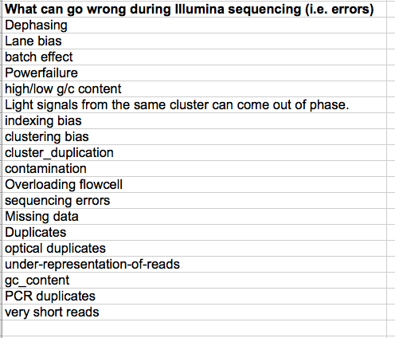
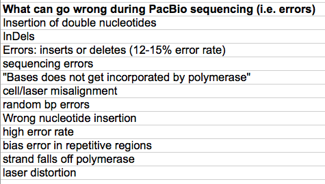

Intro to High Throughput Sequencing and applications
=======================================
Day 1-3 of the INF-BIO5151/9121 course "High Throughput Sequencing technologies and bioinformatics analysis"

Detailed schedule:

<table>
<thead>
<tr class="header">
<th align="left">Day</th>
<th align="left">Time</th>
<th align="left">Subject</th>
</tr>
</thead>
<tbody>
<tr class="odd">
<td align="left">Day 1</td>
<td align="left">morning</td>
<td align="left">Sequencing technologies &amp; applications</td>
</tr>
<tr class="even">
<td align="left">Day 1</td>
<td align="left">afternoon</td>
<td align="left">Sequencing applications (until 14:00), Q&amp;A genomics</td>
</tr>
<tr class="odd">
<td align="left">Day 2</td>
<td align="left">morning</td>
<td align="left">Q&amp;A library preparation and sequencing; Intro HTS analysis</td>
</tr>
<tr class="even">
<td align="left">Day 2</td>
<td align="left">afternoon</td>
<td align="left">Set up computers, Experimental design</td>
</tr>
<tr class="odd">
<td align="left">Day 3</td>
<td align="left">morning</td>
<td align="left">Read QC + trimming</td>
</tr>
<tr class="even">
<td align="left">Day 3</td>
<td align="left">morning</td>
<td align="left">Project organisation, Q&amp;A Unix</td>
</tr>
</tbody>
</table>

# Day 1

## Sequencing technologies

### What sequencing platforms do you know
Exercise using Mentimeter wordcloud

* Illumina HiSeq 1000 1500 2000 2500 3000 4000
* Illumina HiSeq X (Five and Ten)
* Illumina NextSeq 500
* Illumina MiSeq
* Illumina MiniSeq
* Pacific Biosciences RSII
* Pacific Biosciences Sequel
* Ion Torrent PGM
* Ion Torrent Proton
* Ion Torrent S5 and S5XL
* Oxford Nanopore MinION (MkI)
* Oxford Nanopore PromethION
* SOLiD 1 2 3 4 5500 5500XL
* BGISEQ-500
* ABI Sanger 3730xl

Obsolete:

* Roche 454 GS FLX, Junior
* HeliScope

Special types

* 10X genomics
* Dovetail Genomics
* Moleculo/TruSeq synthetic reads
* BioNano Genomics

### Read lengths versus throughput for sequencing instruments
Exercise using Google sheets:

* for each sequencing instrument still being sold, find the specifications on the company website
* make a plot in a google spreadsheet with the read length on the x-axis and the per-run throughput in Gigabp on the Y axis
* make both axis log scale
* my example is [here](https://docs.google.com/spreadsheets/d/1BluwxeEfAK2QEIprPdzJK_Nsmqlkl9Xue5zQmBSCi44/edit#gid=0)

Discuss my version on figshare: <http://figshare.com/articles/developments_in_NGS/100940>. See also [my blog post](https://flxlexblog.wordpress.com/2016/07/08/developments-in-high-throughput-sequencing-july-2016-edition/) on the most recent edition.

Slide with figure 1 from [Reuter *et al* 2015](http://dx.doi.org/10.1016/j.molcel.2015.05.004).

### Details on the technology behind the different sequencing platforms

*In detail:* Illumina library preparation and sequencing  
<https://www.youtube.com/watch?v=womKfikWlxM>

*In detail:* PacBio library preparation and sequencing  
<https://www.youtube.com/watch?v=v8p4ph2MAvI> and <https://www.youtube.com/watch?v=WMZmG00uhwU>
*Slide:* SMRTBell

*In detail:* Oxford Nanopore MinION library preparation and sequencing  
<https://www2.nanoporetech.com/science-technology/movies#movie-24-nanopore-dna-sequencing>

*In detail:* 10X genomics
<https://vimeo.com/120429438>

*In detail:* BioNano Genomics
<https://vimeo.com/116090215>

### What read types do you know?

Slides/whiteboard: Paired end versus single end versus mate pair, subreads, 2D reads

### What applications do you know of for HTS?
Exercise using mentimeter wordcloud

Illumina [has a poster](http://www.illumina.com/applications/sequencing/ngs-library-prep/library-prep-methods.html) with all library preparation methods. 

Lior Pachter has "an up-to-date annotated bibliography of *Seq assays (functional genomics assays based on high-througphput sequencing)" on [this page](https://liorpachter.wordpress.com/seq/).

Slide with figure 4 from [Reuter *et al* 2015](http://dx.doi.org/10.1016/j.molcel.2015.05.004).

### Selected applications

* RNA-seq
* Assembly and metagenomics
* ChIP-seq
* Amplicon sequencing
* SNP typing and discovery
* Single-cell sequencing

Early finish at 14:00

### OPTIONAL: Q&A session on genomics/genetics/biology

For those students not well versed in biological subjects

# Day 2

## Q&A with sequencing experts

We will be visited by Gregor Gilfillan and Ave Tooming-Klunderud from the Norwegian Sequencing Centre

## Principles and problems of HTS data analysis

### What skills do you think you need for analysing HTS data?
Exercise using mentimeter wordcloud.  

'Tube map' from <http://nirvacana.com/thoughts/becoming-a-data-scientist/>.

### Usefulness versus time needed to master

Exercise using mentimeter

Subject|Items|HTS data analysis example
-------|-----|-------------------------
|**Data**| Amount of data|multi-GB fastq files|
||Finding data|ENA, SRA, ensembl, UCSC|
||Getting data in the right shape|fastq versions|
||Scrubbing|read errors, denoising of amplicons|
||Understanding the data (file formats)|vcf file format|
||Data management (storing, copying, moving data)|store bam files or not?|
||Sharing data|ENA, SRA|
|**Software**|Understanding the algorithms|mapping reads|
||Installing software|don't get me started|
||Choosing program amongst all possible|mapping programs|
||Can not always use the same tool|availability of a reference genome|
||Not always the same tool that is best|iMetAmos|
||Software parameter space|kmer size for assembly|
||Validation of computational results|assembly comparison|
|**Compute resources**|Local versus HPC versus cloud|Abel versus Amazon|
||Computational time|mapping versus assembly|
||Getting access|Abel|
||Optimal use of HPC resources|disk I/O for life science applications|
|**User interfaces**|unix shell|bwa|
||web-based|Galaxy, Hyperbrowser|
||GUI-based|Microsoft office, CLCBio|
|**Skills**|Unix skills|ssh, rsync|
||Programming skills|R, python|
||Statistics|GWAS|
|**Ethics**|Ethical approval|human subjects|
||Sensitive data|human sequencing data|
||Reproducibility|pipelines|

### Ranking skills important for analysing HTS data
Mentimeter exercise

[Anscombe's quartet](https://en.m.wikipedia.org/wiki/Anscombe's_quartet): https://en.m.wikipedia.org/wiki/Anscombe's_quartet

### What are the basic skills we want you to learn?

* Technical / bioinformatic
   * Study design
   * Mapping principles
   * Alignment principles
   * Alternative splicing
   * Model system vs non-model system organisms
* The practice of bioinformatics / computational biology
   * Transparency/reproducibility
   * Data management
   * Statistics and hypothesis testing
   * Summary statistics and visualization
   * Sanity checking / validation of results
   * Finding data and munging it (incl. public databases)

## Setting up computers

Each student should have access to the course server.

## Experimental design

Guest lecture and exercise by Arvind Sundaram.

# Day 3

## Some aspects of errors in reads

### What can go wrong during Illumina sequencing (i.e. errors)
Mentimeter exercise

### What can go wrong during PacBio sequencing (i.e. errors)
Mentimeter exercise

Slide: PacBio sequencing explained from the Metzker paper

Slide: GC bias plot from this Laehnemann et al paper

Batch effects: see <http://bitesizebio.com/20998/beware-the-bane-of-batch-effects/>

### Practical: Read QC and trimming

### Extra: sequencing.qcfail.com

Check out these plots first, discuss, only then read the entire article

* Case 1
  * <https://sequencing.qcfail.com/wp-content/uploads/sites/2/2016/05/single_seq_quality.png>
  * <https://sequencing.qcfail.com/articles/illumina-2-colour-chemistry-can-overcall-high-confidence-g-bases/>

* Case 2
  * <https://sequencing.qcfail.com/wp-content/uploads/sites/2/2016/03/biased_composition.png>
  * <https://sequencing.qcfail.com/articles/biased-sequence-composition-can-lead-to-poor-quality-data-on-illumina-sequencers/>

* Case 3
  * <https://sequencing.qcfail.com/wp-content/uploads/sites/2/2016/03/priming_bias_check.png>
  * <https://sequencing.qcfail.com/articles/data-can-be-corrupted-upon-extraction-from-sra-files/>

* Case 4
  * <https://sequencing.qcfail.com/wp-content/uploads/sites/2/2016/02/adapter_content_plot.png>
  * <https://sequencing.qcfail.com/articles/read-through-adapters-can-appear-at-the-ends-of-sequencing-reads/>

* Case 5
  * <https://sequencing.qcfail.com/wp-content/uploads/sites/2/2016/02/phix_duplication.png>
  * <https://sequencing.qcfail.com/articles/libraries-can-contain-technical-duplication/>

* Case 6
  * <https://sequencing.qcfail.com/wp-content/uploads/sites/2/2016/02/adapter_dimer_gc_profile.png>
  * <https://sequencing.qcfail.com/articles/contamination-with-adapter-dimers/>

* Case 7
  * <https://sequencing.qcfail.com/wp-content/uploads/sites/2/2016/01/per_tile_bubble.png>
  * <https://sequencing.qcfail.com/articles/position-specific-failures-of-flowcells/>

## Project organisation

Slides: basic principles.

## Optional: Q&A Unix